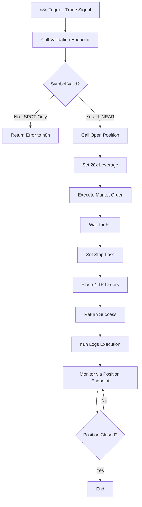

# Product Requirements Document: Bybit Trading API Enhancement

**Version:** 1.0  
**Date:** January 7, 2026  
**Status:** Ready for Implementation

---

## 1. Executive Summary

This PRD defines the requirements for enhancing the existing Bybit Trading API with pre-trade validation and comprehensive trade execution flow. The system will ONLY trade LINEAR perpetual contracts (with leverage support) and reject SPOT trading pairs.

---

## 2. Background & Context

### 2.1 Current Implementation

We have implemented a Trading API microservice that:
- Executes trades via POST `/api/trade/open`
- Closes positions via POST `/api/trade/close`
- Monitors positions via GET `/api/trade/position`
- Uses 20x leverage with Ottimus SP20 strategy
- Places market entry + 4 TP limit orders + 1 stop loss

### 2.2 Problem Statement

Currently, the API does not validate:
1. Whether a symbol supports LINEAR perpetual trading
2. If leverage is available for the requested symbol
3. If TP/SL (Take Profit/Stop Loss) can be set
4. Proper order sizing (tick size, quantity step, min/max limits)

**Risk:** Executing trades on SPOT pairs will fail or result in incorrect behavior since SPOT doesn't support leverage, position-based SL/TP, or reduce-only orders.

### 2.3 Strategy Overview: Ottimus SP20

- **Entry:** Market order with 20x leverage
- **Stop Loss:** 20% of account (1% price distance from entry)
- **Take Profits:** 4 limit orders at +2%, +3%, +4%, +5% from entry
- **Position Size:** 25% per TP level (total 100% position)

---

## 3. Requirements

### 3.1 Functional Requirements

#### FR-1: Pre-Trade Validation Endpoint
- **Endpoint:** `GET /api/trade/validate/:symbol`
- **Purpose:** Validate if a symbol can be traded with the Ottimus SP20 strategy
- **Must Check:**
  - Symbol exists and is actively trading
  - Symbol is a LINEAR perpetual contract (NOT spot)
  - Supports 20x leverage
  - Supports TP/SL functionality
  - Returns order sizing parameters (tick size, qty step, min/max)

#### FR-2: Category Enforcement
- **Rule:** ONLY trade LINEAR category
- **Validation:** If symbol only exists in SPOT category → reject with clear error
- **Error Message:** "Symbol {symbol} is only available for SPOT trading. LINEAR perpetual contract required for leverage trading."

#### FR-3: Enhanced Trade Execution Flow
- **Execution Order:**
  1. Pre-flight validation (instrument info + current price)
  2. Set leverage to 20x
  3. Execute market entry order
  4. Wait for order fill confirmation
  5. Set position stop loss
  6. Place 4 TP limit orders (reduce-only)
  7. Return execution summary with all order IDs

#### FR-4: Position Monitoring Enhancement
- **Endpoint:** `GET /api/trade/position/:symbol`
- **Must Return:**
  - Current position size and direction
  - Entry price and current price
  - Unrealized P&L (USD and %)
  - Active TP orders status
  - Stop loss level
  - Leverage used

#### FR-5: Market Data Endpoint
- **Endpoint:** `GET /api/trade/market/:symbol`
- **Purpose:** Get real-time market data for decision making
- **Returns:**
  - Current price (bid/ask)
  - 24h price change
  - 24h volume
  - Orderbook snapshot (optional)

### 3.2 Non-Functional Requirements

#### NFR-1: Performance
- Validation endpoint: < 500ms response time
- Trade execution: < 3 seconds total (all steps)
- Use caching for instrument info (1 hour TTL)

#### NFR-2: Reliability
- Retry logic for failed TP/SL orders (max 3 attempts)
- Rollback on partial failure (cancel orders if SL cannot be set)
- Detailed error logging with Bybit error codes

#### NFR-3: Security
- All endpoints protected with `Authorization: Bearer` token
- Rate limiting: 10 requests/minute per API key
- Validate all user inputs (symbol format, margin amount)

---

## 4. API Specifications

### 4.1 Validation Endpoint

#### `GET /api/trade/validate/:symbol`

**Request:**
```http
GET /api/trade/validate/EVAAUSDT
Authorization: Bearer <TRADING_API_SECRET>
```

**Response (Success - Linear Available):**
```json
{
  "success": true,
  "symbol": "EVAAUSDT",
  "category": "linear",
  "status": "Trading",
  "canTrade": true,
  "contractType": "LinearPerpetual",
  "leverage": {
    "min": 1,
    "max": 20,
    "step": 0.01,
    "requested": 20,
    "allowed": true
  },
  "orderSizing": {
    "tickSize": "0.0001",
    "qtyStep": "0.1",
    "minOrderQty": "0.1",
    "maxOrderQty": "31000.0",
    "minNotional": "5"
  },
  "marketData": {
    "lastPrice": "1.2471",
    "bid": "1.2471",
    "ask": "1.2472",
    "change24h": "-0.089043"
  },
  "features": {
    "leverage": true,
    "stopLoss": true,
    "takeProfit": true,
    "reduceOnly": true
  },
  "calculatedLevels": {
    "entryPrice": "1.2471",
    "stopLoss": "1.23463",
    "takeProfit1": "1.27204",
    "takeProfit2": "1.28450",
    "takeProfit3": "1.29695",
    "takeProfit4": "1.30941"
  }
}
```

**Response (Failure - Only Spot Available):**
```json
{
  "success": false,
  "symbol": "BTCUSDT",
  "category": "spot",
  "status": "Trading",
  "canTrade": false,
  "reason": "Symbol BTCUSDT is only available for SPOT trading. LINEAR perpetual contract required for leverage trading.",
  "recommendation": "Use BTCUSDT with category 'linear' instead.",
  "error": {
    "code": "SPOT_ONLY",
    "message": "This symbol does not support leveraged perpetual trading"
  }
}
```

**Response (Failure - Symbol Not Found):**
```json
{
  "success": false,
  "symbol": "INVALID123",
  "canTrade": false,
  "reason": "Symbol INVALID123 not found on Bybit",
  "error": {
    "code": "SYMBOL_NOT_FOUND",
    "message": "No instrument info found for symbol: INVALID123"
  }
}
```

**Response (Failure - Insufficient Leverage):**
```json
{
  "success": false,
  "symbol": "SOMELOWLEV",
  "category": "linear",
  "status": "Trading",
  "canTrade": false,
  "leverage": {
    "min": 1,
    "max": 10,
    "requested": 20,
    "allowed": false
  },
  "reason": "Symbol SOMELOWLEV only supports up to 10x leverage, but 20x is required",
  "error": {
    "code": "INSUFFICIENT_LEVERAGE",
    "message": "Maximum leverage 10x is below required 20x"
  }
}
```

---

### 4.2 Enhanced Trade Execution Endpoint

#### `POST /api/trade/open`

**Request:**
```http
POST /api/trade/open
Authorization: Bearer <TRADING_API_SECRET>
Content-Type: application/json

{
  "symbol": "EVAAUSDT",
  "direction": "LONG",
  "margin": 100,
  "leverage": 20
}
```

**Enhanced Execution Flow:**

```typescript
// STEP 1: Pre-flight validation
const validation = await validateSymbol(symbol);
if (!validation.canTrade) {
  return {
    success: false,
    error: validation.reason
  };
}

// STEP 2: Calculate position size
const entryPrice = validation.marketData.lastPrice;
const positionValue = margin * leverage; // 100 * 20 = 2000 USDT
const quantity = roundToStep(
  positionValue / entryPrice,
  validation.orderSizing.qtyStep
);

// STEP 3: Set leverage
await setLeverage({
  category: 'linear',
  symbol: symbol,
  buyLeverage: '20',
  sellLeverage: '20'
});

// STEP 4: Execute market order
const marketOrder = await createOrder({
  category: 'linear',
  symbol: symbol,
  side: direction === 'LONG' ? 'Buy' : 'Sell',
  orderType: 'Market',
  qty: quantity.toString(),
  positionIdx: 0
});

// STEP 5: Wait for fill (poll order status)
const filledOrder = await waitForFill(marketOrder.orderId, 5000); // 5s timeout
const actualEntryPrice = filledOrder.avgPrice;

// STEP 6: Calculate and set stop loss (1% below entry for LONG)
const stopLossPrice = roundToTick(
  actualEntryPrice * (direction === 'LONG' ? 0.99 : 1.01),
  validation.orderSizing.tickSize
);

await setTradingStop({
  category: 'linear',
  symbol: symbol,
  stopLoss: stopLossPrice.toString(),
  positionIdx: 0
});

// STEP 7: Place 4 TP limit orders (25% each)
const tpLevels = [1.02, 1.03, 1.04, 1.05]; // +2%, +3%, +4%, +5%
const tpQuantity = roundToStep(quantity / 4, validation.orderSizing.qtyStep);
const tpOrders = [];

for (const level of tpLevels) {
  const tpPrice = roundToTick(
    actualEntryPrice * level,
    validation.orderSizing.tickSize
  );
  
  const tpOrder = await createOrder({
    category: 'linear',
    symbol: symbol,
    side: direction === 'LONG' ? 'Sell' : 'Buy',
    orderType: 'Limit',
    qty: tpQuantity.toString(),
    price: tpPrice.toString(),
    reduceOnly: true,
    positionIdx: 0,
    timeInForce: 'GTC'
  });
  
  tpOrders.push(tpOrder);
}

// STEP 8: Return execution summary
return {
  success: true,
  execution: {
    symbol: symbol,
    direction: direction,
    leverage: 20,
    entryPrice: actualEntryPrice,
    quantity: quantity,
    positionValue: positionValue,
    orders: {
      market: {
        orderId: marketOrder.orderId,
        status: 'Filled',
        avgPrice: actualEntryPrice
      },
      stopLoss: {
        price: stopLossPrice,
        status: 'Active'
      },
      takeProfits: tpOrders.map((order, index) => ({
        level: index + 1,
        orderId: order.orderId,
        price: order.price,
        quantity: tpQuantity,
        status: 'Active'
      }))
    }
  }
};
```

**Response (Success):**
```json
{
  "success": true,
  "timestamp": "2026-01-07T01:30:00.000Z",
  "execution": {
    "symbol": "EVAAUSDT",
    "direction": "LONG",
    "leverage": 20,
    "entryPrice": "1.2471",
    "quantity": "1603.3",
    "positionValue": "2000.00",
    "margin": "100.00",
    "orders": {
      "market": {
        "orderId": "1234567890",
        "status": "Filled",
        "avgPrice": "1.2471",
        "executedQty": "1603.3",
        "executedAt": "2026-01-07T01:30:01.234Z"
      },
      "stopLoss": {
        "price": "1.2346",
        "status": "Active",
        "distance": "-1.00%"
      },
      "takeProfits": [
        {
          "level": 1,
          "orderId": "1234567891",
          "price": "1.2720",
          "quantity": "400.8",
          "percentage": "25%",
          "profit": "+2.00%",
          "status": "Active"
        },
        {
          "level": 2,
          "orderId": "1234567892",
          "price": "1.2845",
          "quantity": "400.8",
          "percentage": "25%",
          "profit": "+3.00%",
          "status": "Active"
        },
        {
          "level": 3,
          "orderId": "1234567893",
          "price": "1.2970",
          "quantity": "400.8",
          "percentage": "25%",
          "profit": "+4.00%",
          "status": "Active"
        },
        {
          "level": 4,
          "orderId": "1234567894",
          "price": "1.3094",
          "quantity": "400.9",
          "percentage": "25%",
          "profit": "+5.00%",
          "status": "Active"
        }
      ]
    }
  }
}
```

**Response (Failure - Validation Failed):**
```json
{
  "success": false,
  "error": {
    "code": "VALIDATION_FAILED",
    "message": "Symbol BTCUSDT is only available for SPOT trading",
    "details": {
      "symbol": "BTCUSDT",
      "category": "spot",
      "reason": "LINEAR perpetual contract required for leverage trading"
    }
  }
}
```

**Response (Failure - Partial Execution):**
```json
{
  "success": false,
  "error": {
    "code": "PARTIAL_EXECUTION",
    "message": "Failed to set stop loss after market entry",
    "details": {
      "symbol": "EVAAUSDT",
      "marketOrder": {
        "orderId": "1234567890",
        "status": "Filled",
        "avgPrice": "1.2471"
      },
      "failedStep": "SET_STOP_LOSS",
      "bybitError": "Price too close to mark price",
      "action": "Position opened but without stop loss. Manual intervention required."
    }
  },
  "recovery": {
    "positionOpened": true,
    "closeEndpoint": "POST /api/trade/close",
    "monitorEndpoint": "GET /api/trade/position/EVAAUSDT"
  }
}
```

---

### 4.3 Market Data Endpoint

#### `GET /api/trade/market/:symbol`

**Request:**
```http
GET /api/trade/market/EVAAUSDT
Authorization: Bearer <TRADING_API_SECRET>
```

**Response:**
```json
{
  "success": true,
  "symbol": "EVAAUSDT",
  "category": "linear",
  "timestamp": "2026-01-07T01:30:00.000Z",
  "price": {
    "last": "1.2471",
    "bid": "1.2471",
    "ask": "1.2472",
    "spread": "0.0001",
    "markPrice": "1.2470"
  },
  "change24h": {
    "percent": "-0.089043",
    "high": "1.5285",
    "low": "1.2231",
    "volume": "11451526.4000",
    "turnover": "15689829.1251"
  },
  "fundingRate": {
    "current": "0.0001",
    "nextFundingTime": "2026-01-07T04:00:00.000Z",
    "countdown": "2h 30m"
  }
}
```

---

### 4.4 Enhanced Position Monitoring

#### `GET /api/trade/position/:symbol`

**Request:**
```http
GET /api/trade/position/EVAAUSDT
Authorization: Bearer <TRADING_API_SECRET>
```

**Response (Active Position):**
```json
{
  "success": true,
  "hasPosition": true,
  "symbol": "EVAAUSDT",
  "category": "linear",
  "timestamp": "2026-01-07T01:35:00.000Z",
  "position": {
    "side": "Buy",
    "size": "1603.3",
    "leverage": "20",
    "entryPrice": "1.2471",
    "markPrice": "1.2580",
    "liquidationPrice": "1.1847",
    "margin": "100.00",
    "positionValue": "2000.00"
  },
  "pnl": {
    "unrealizedPnl": "17.47",
    "unrealizedPnlPercent": "17.47%",
    "realisedPnl": "0.00",
    "roi": "17.47%"
  },
  "orders": {
    "stopLoss": {
      "active": true,
      "price": "1.2346",
      "distance": "-1.86%",
      "potentialLoss": "-20.00"
    },
    "takeProfits": [
      {
        "level": 1,
        "orderId": "1234567891",
        "status": "Active",
        "price": "1.2720",
        "quantity": "400.8",
        "filled": "0",
        "distance": "+1.11%"
      },
      {
        "level": 2,
        "orderId": "1234567892",
        "status": "Active",
        "price": "1.2845",
        "quantity": "400.8",
        "filled": "0",
        "distance": "+2.11%"
      },
      {
        "level": 3,
        "orderId": "1234567893",
        "status": "PartiallyFilled",
        "price": "1.2970",
        "quantity": "400.8",
        "filled": "200.0",
        "distance": "+3.10%"
      },
      {
        "level": 4,
        "orderId": "1234567894",
        "status": "Filled",
        "price": "1.3094",
        "quantity": "400.9",
        "filled": "400.9",
        "distance": "+4.09%",
        "filledAt": "2026-01-07T01:32:15.000Z"
      }
    ]
  },
  "risk": {
    "distanceToLiquidation": "-5.00%",
    "distanceToStopLoss": "-1.86%",
    "riskLevel": "MODERATE"
  }
}
```

**Response (No Position):**
```json
{
  "success": true,
  "hasPosition": false,
  "symbol": "EVAAUSDT",
  "category": "linear",
  "timestamp": "2026-01-07T01:35:00.000Z",
  "message": "No active position for EVAAUSDT"
}
```

---

### 4.5 Close Position (Already Implemented - Enhancement)

#### `POST /api/trade/close`

**Request:**
```http
POST /api/trade/close
Authorization: Bearer <TRADING_API_SECRET>
Content-Type: application/json

{
  "symbol": "EVAAUSDT"
}
```

**Enhanced Response:**
```json
{
  "success": true,
  "symbol": "EVAAUSDT",
  "timestamp": "2026-01-07T01:40:00.000Z",
  "actions": [
    {
      "step": 1,
      "action": "Cancel All Orders",
      "status": "Success",
      "canceledOrders": 3,
      "details": ["TP1: 1234567891", "TP2: 1234567892", "TP3: 1234567893"]
    },
    {
      "step": 2,
      "action": "Market Close Position",
      "status": "Success",
      "orderId": "1234567899",
      "closePrice": "1.2580",
      "quantity": "1002.5",
      "pnl": "10.92"
    }
  ],
  "finalPnl": {
    "realized": "10.92",
    "percentage": "10.92%",
    "roi": "10.92%",
    "fees": "2.00",
    "netPnl": "8.92"
  }
}
```

---

## 5. Technical Implementation Details

### 5.1 Bybit API Endpoints to Use

| Purpose | Bybit Endpoint | Method |
|---------|---------------|--------|
| Get instrument info | `/v5/market/instruments-info` | GET |
| Get ticker | `/v5/market/tickers` | GET |
| Set leverage | `/v5/position/set-leverage` | POST |
| Create order | `/v5/order/create` | POST |
| Get order | `/v5/order/realtime` | GET |
| Set stop loss | `/v5/position/trading-stop` | POST |
| Get position | `/v5/position/list` | GET |
| Cancel all orders | `/v5/order/cancel-all` | POST |

### 5.2 Helper Functions Required

#### 5.2.1 Rounding Functions

```typescript
/**
 * Round price to tick size
 * Example: roundToTick(1.24712, 0.0001) => 1.2471
 */
function roundToTick(price: number, tickSize: string): number {
  const tick = parseFloat(tickSize);
  return Math.floor(price / tick) * tick;
}

/**
 * Round quantity to step size
 * Example: roundToStep(1603.37, 0.1) => 1603.3
 */
function roundToStep(quantity: number, qtyStep: string): number {
  const step = parseFloat(qtyStep);
  return Math.floor(quantity / step) * step;
}

/**
 * Validate minimum notional value
 * Example: validateNotional(10, 1.2471, 5) => true (10 * 1.2471 = 12.471 > 5)
 */
function validateNotional(qty: number, price: number, minNotional: number): boolean {
  return qty * price >= minNotional;
}
```

#### 5.2.2 Category Detection

```typescript
/**
 * Detect category for a symbol
 * Returns: 'linear' | 'spot' | null
 */
async function detectCategory(symbol: string): Promise<{
  category: 'linear' | 'spot' | null;
  data: any;
}> {
  // Try linear first
  try {
    const linearData = await getInstrumentInfo(symbol, 'linear');
    if (linearData && linearData.status === 'Trading') {
      return { category: 'linear', data: linearData };
    }
  } catch (error) {
    // Continue to spot
  }
  
  // Try spot
  try {
    const spotData = await getInstrumentInfo(symbol, 'spot');
    if (spotData && spotData.status === 'Trading') {
      return { category: 'spot', data: spotData };
    }
  } catch (error) {
    // Symbol not found
  }
  
  return { category: null, data: null };
}
```

#### 5.2.3 Validation Logic

```typescript
/**
 * Validate if symbol can be traded with Ottimus SP20 strategy
 */
async function validateSymbol(symbol: string): Promise<ValidationResult> {
  // Step 1: Detect category
  const detection = await detectCategory(symbol);
  
  if (!detection.category) {
    return {
      success: false,
      canTrade: false,
      reason: `Symbol ${symbol} not found on Bybit`,
      error: { code: 'SYMBOL_NOT_FOUND' }
    };
  }
  
  // Step 2: Reject if SPOT
  if (detection.category === 'spot') {
    return {
      success: false,
      symbol: symbol,
      category: 'spot',
      canTrade: false,
      reason: `Symbol ${symbol} is only available for SPOT trading. LINEAR perpetual contract required for leverage trading.`,
      error: { code: 'SPOT_ONLY' }
    };
  }
  
  // Step 3: Validate leverage (must support 20x)
  const maxLeverage = parseFloat(detection.data.leverageFilter.maxLeverage);
  if (maxLeverage < 20) {
    return {
      success: false,
      symbol: symbol,
      category: 'linear',
      canTrade: false,
      leverage: {
        max: maxLeverage,
        requested: 20,
        allowed: false
      },
      reason: `Symbol ${symbol} only supports up to ${maxLeverage}x leverage, but 20x is required`,
      error: { code: 'INSUFFICIENT_LEVERAGE' }
    };
  }
  
  // Step 4: Get current market data
  const ticker = await getTicker(symbol, 'linear');
  
  // Step 5: Return validation success
  return {
    success: true,
    symbol: symbol,
    category: 'linear',
    canTrade: true,
    contractType: detection.data.contractType,
    status: detection.data.status,
    leverage: {
      min: parseFloat(detection.data.leverageFilter.minLeverage),
      max: maxLeverage,
      step: parseFloat(detection.data.leverageFilter.leverageStep),
      requested: 20,
      allowed: true
    },
    orderSizing: {
      tickSize: detection.data.priceFilter.tickSize,
      qtyStep: detection.data.lotSizeFilter.qtyStep,
      minOrderQty: detection.data.lotSizeFilter.minOrderQty,
      maxOrderQty: detection.data.lotSizeFilter.maxOrderQty
    },
    marketData: {
      lastPrice: ticker.lastPrice,
      bid: ticker.bid1Price,
      ask: ticker.ask1Price,
      change24h: ticker.price24hPcnt
    },
    features: {
      leverage: true,
      stopLoss: true,
      takeProfit: true,
      reduceOnly: true
    }
  };
}
```

#### 5.2.4 Wait for Order Fill

```typescript
/**
 * Poll order status until filled or timeout
 */
async function waitForFill(
  orderId: string,
  symbol: string,
  timeoutMs: number = 5000
): Promise<OrderFillResult> {
  const startTime = Date.now();
  const pollInterval = 200; // Check every 200ms
  
  while (Date.now() - startTime < timeoutMs) {
    const order = await getOrder({
      category: 'linear',
      symbol: symbol,
      orderId: orderId
    });
    
    if (order.orderStatus === 'Filled') {
      return {
        success: true,
        orderId: orderId,
        status: 'Filled',
        avgPrice: order.avgPrice,
        executedQty: order.cumExecQty,
        fee: order.cumExecFee
      };
    }
    
    if (order.orderStatus === 'Rejected' || order.orderStatus === 'Cancelled') {
      throw new Error(`Order ${orderId} failed: ${order.orderStatus}`);
    }
    
    await sleep(pollInterval);
  }
  
  throw new Error(`Order ${orderId} fill timeout after ${timeoutMs}ms`);
}
```

### 5.3 Caching Strategy

```typescript
// Cache instrument info for 1 hour
const instrumentCache = new Map<string, {
  data: InstrumentInfo;
  timestamp: number;
}>();

const CACHE_TTL = 60 * 60 * 1000; // 1 hour

async function getCachedInstrumentInfo(symbol: string, category: string) {
  const cacheKey = `${symbol}:${category}`;
  const cached = instrumentCache.get(cacheKey);
  
  if (cached && Date.now() - cached.timestamp < CACHE_TTL) {
    return cached.data;
  }
  
  const data = await getInstrumentInfo(symbol, category);
  instrumentCache.set(cacheKey, {
    data: data,
    timestamp: Date.now()
  });
  
  return data;
}
```

### 5.4 Error Handling

#### Common Bybit Error Codes

| Code | Message | Handling |
|------|---------|----------|
| 10001 | Parameter error | Validate inputs before sending |
| 10003 | Invalid API key | Return authentication error |
| 10004 | Invalid signature | Check signature generation |
| 10005 | Permission denied | Check API key permissions |
| 110001 | Order does not exist | Handle gracefully in position query |
| 110003 | Order price is out of range | Adjust price within bounds |
| 110004 | Insufficient balance | Return clear error to user |
| 110007 | Order quantity exceeds upper limit | Reduce position size |
| 110043 | Set leverage not modified | OK to continue (already set) |

#### Retry Logic

```typescript
async function retryWithBackoff<T>(
  fn: () => Promise<T>,
  maxRetries: number = 3,
  baseDelay: number = 1000
): Promise<T> {
  for (let i = 0; i < maxRetries; i++) {
    try {
      return await fn();
    } catch (error) {
      if (i === maxRetries - 1) throw error;
      
      const delay = baseDelay * Math.pow(2, i);
      await sleep(delay);
    }
  }
  throw new Error('Max retries exceeded');
}
```

---

## 6. Testing Requirements

### 6.1 Validation Endpoint Tests

```bash
# Test 1: Valid LINEAR symbol
curl -X GET "https://your-app.fly.dev/api/trade/validate/EVAAUSDT" \
  -H "Authorization: Bearer <secret>"
# Expected: success=true, canTrade=true

# Test 2: SPOT only symbol
curl -X GET "https://your-app.fly.dev/api/trade/validate/BTCUSDT" \
  -H "Authorization: Bearer <secret>"
# Expected: success=false, reason="SPOT only"

# Test 3: Invalid symbol
curl -X GET "https://your-app.fly.dev/api/trade/validate/INVALID123" \
  -H "Authorization: Bearer <secret>"
# Expected: success=false, code="SYMBOL_NOT_FOUND"

# Test 4: Low leverage symbol (if exists)
curl -X GET "https://your-app.fly.dev/api/trade/validate/LOWLEV" \
  -H "Authorization: Bearer <secret>"
# Expected: success=false, code="INSUFFICIENT_LEVERAGE"
```

### 6.2 Trade Execution Tests

```bash
# Test 1: Full execution flow (TESTNET)
curl -X POST "https://your-app.fly.dev/api/trade/open" \
  -H "Authorization: Bearer <secret>" \
  -H "Content-Type: application/json" \
  -d '{
    "symbol": "EVAAUSDT",
    "direction": "LONG",
    "margin": 10
  }'
# Expected: All orders placed successfully

# Test 2: Invalid symbol rejection
curl -X POST "https://your-app.fly.dev/api/trade/open" \
  -H "Authorization: Bearer <secret>" \
  -H "Content-Type: application/json" \
  -d '{
    "symbol": "BTCUSDT",
    "direction": "LONG",
    "margin": 10
  }'
# Expected: Validation error before execution
```

### 6.3 Position Monitoring Tests

```bash
# Test 1: Active position
curl -X GET "https://your-app.fly.dev/api/trade/position/EVAAUSDT" \
  -H "Authorization: Bearer <secret>"
# Expected: Position details with P&L

# Test 2: No position
curl -X GET "https://your-app.fly.dev/api/trade/position/CLOUSDT" \
  -H "Authorization: Bearer <secret>"
# Expected: hasPosition=false
```

---

## 7. Deployment Checklist

### 7.1 Environment Variables

Add these to Fly.io secrets (if not already set):

```bash
fly secrets set TRADING_API_SECRET="your-secure-secret"
fly secrets set BYBIT_API_KEY="your-api-key"
fly secrets set BYBIT_API_SECRET="your-api-secret"
fly secrets set BYBIT_TESTNET="true"  # Use testnet for development
fly secrets set CACHE_TTL="3600"      # 1 hour cache
fly secrets set ORDER_TIMEOUT="5000"  # 5 second timeout
fly secrets set MAX_RETRIES="3"       # Retry failed orders 3 times
```

### 7.2 API Key Permissions Required

Ensure Bybit API key has these permissions:
- ✅ Read: Market data, Positions, Orders
- ✅ Write: Orders, Position (for leverage & trading-stop)
- ❌ Withdraw: NOT required (safer)

### 7.3 Pre-Deployment Tests

1. Test on TESTNET first (`BYBIT_TESTNET=true`)
2. Verify validation endpoint rejects SPOT symbols
3. Execute small test trade (margin=5 USDT)
4. Verify all 4 TP orders are placed
5. Verify stop loss is set correctly
6. Test close position (panic button)
7. Switch to mainnet only after all tests pass

---

## 8. Success Criteria

### 8.1 Functional Success
- ✅ Validation endpoint correctly identifies LINEAR vs SPOT
- ✅ SPOT symbols are rejected with clear error messages
- ✅ Trade execution completes all steps in order
- ✅ Stop loss is set within 1% of entry price
- ✅ All 4 TP orders are placed at correct levels
- ✅ Position monitoring returns real-time P&L
- ✅ Close position cancels all orders and exits position

### 8.2 Performance Success
- ✅ Validation response < 500ms
- ✅ Full trade execution < 3 seconds
- ✅ Cache hit rate > 80% for validation endpoint

### 8.3 Reliability Success
- ✅ Zero partial executions (all-or-nothing)
- ✅ Proper error handling for all Bybit errors
- ✅ Retry logic prevents transient failures

---

## 9. API Summary Table

| Endpoint | Method | Purpose | Priority |
|----------|--------|---------|----------|
| `/api/trade/validate/:symbol` | GET | Pre-trade validation | **P0 - Critical** |
| `/api/trade/open` | POST | Execute Ottimus SP20 | **P0 - Critical** |
| `/api/trade/close` | POST | Panic close position | P0 - Already exists |
| `/api/trade/position/:symbol` | GET | Monitor position | **P1 - High** |
| `/api/trade/market/:symbol` | GET | Get market data | **P2 - Medium** |

---

## 10. Example Workflow

### Complete User Journey



---

## 11. Open Questions

1. **Q:** Should we support different TP/SL strategies, or always use Ottimus SP20?  
   **A:** Start with fixed SP20, add flexibility in v2

2. **Q:** How to handle funding fees in P&L calculation?  
   **A:** Include in position endpoint under "realized PnL"

3. **Q:** Should we support SHORT positions?  
   **A:** Yes, direction parameter already supports "SHORT"

4. **Q:** Cache invalidation strategy?  
   **A:** Time-based (1 hour) + manual clear endpoint for debugging

---

## 12. Future Enhancements (Post-MVP)

- [ ] Support for other leverage levels (10x, 15x, 25x)
- [ ] Custom TP/SL percentages
- [ ] Trailing stop loss
- [ ] Partial position close
- [ ] Trade history endpoint
- [ ] Real-time WebSocket updates
- [ ] Risk management (max position size, daily loss limit)
- [ ] Multi-position management

---

## Appendix A: Code Examples

### Example: NestJS Controller Structure

```typescript
import { Controller, Get, Post, Body, Param, UseGuards } from '@nestjs/common';
import { TradingService } from './trading.service';
import { ApiKeyGuard } from '../guards/api-key.guard';

@Controller('api/trade')
@UseGuards(ApiKeyGuard)
export class TradingController {
  constructor(private readonly tradingService: TradingService) {}

  @Get('validate/:symbol')
  async validate(@Param('symbol') symbol: string) {
    return this.tradingService.validateSymbol(symbol);
  }

  @Post('open')
  async open(@Body() dto: OpenTradeDto) {
    return this.tradingService.openPosition(dto);
  }

  @Get('position/:symbol')
  async getPosition(@Param('symbol') symbol: string) {
    return this.tradingService.getPosition(symbol);
  }

  @Get('market/:symbol')
  async getMarket(@Param('symbol') symbol: string) {
    return this.tradingService.getMarketData(symbol);
  }

  @Post('close')
  async close(@Body() dto: CloseTradeDto) {
    return this.tradingService.closePosition(dto);
  }
}
```

---

## Appendix B: Bybit Linear vs Spot Comparison

| Feature | Linear Perpetual | Spot |
|---------|-----------------|------|
| **Contract Type** | Perpetual futures | Physical asset |
| **Leverage** | 1x - 100x (varies) | 1x only (or 3-5x margin) |
| **Position** | Long/Short positions | Own actual coins |
| **Stop Loss** | Position-based SL | OCO orders only |
| **Take Profit** | Position-based TP | Limit sell orders |
| **Funding Fee** | Every 8 hours | None |
| **Settlement** | USDT settled | Coin-to-coin |
| **Reduce Only** | Supported | N/A |
| **Liquidation** | Yes (based on margin) | No (spot = you own it) |

---

**END OF PRD**
